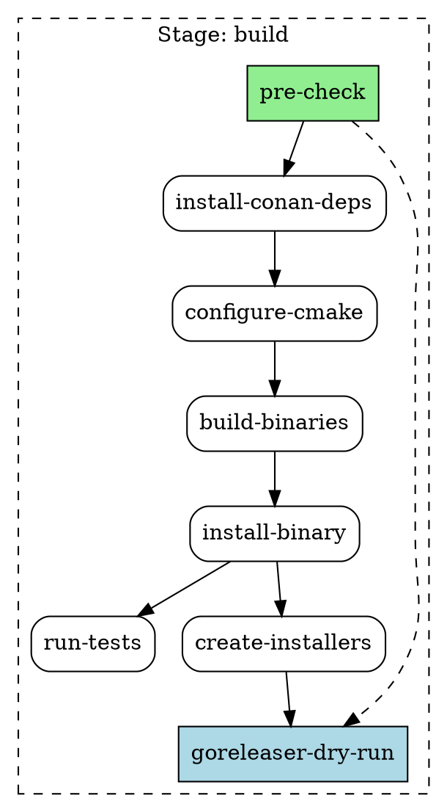
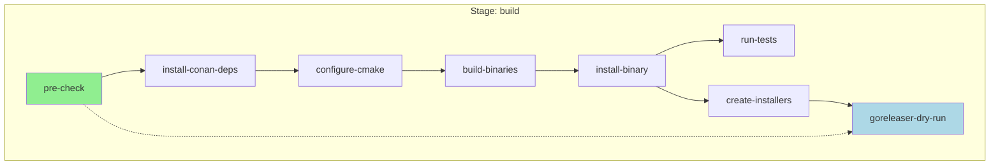

# DAG Graph Visualization Feature - Planning Document

**Feature Name:** DAG Graph Visualization  
**Version Target:** v0.25.0  
**Status:** Planning  
**Created:** 2025-10-10  
**Author:** buildfab development team

## Executive Summary

Implement a comprehensive DAG (Directed Acyclic Graph) visualization feature that allows users to visualize project configuration as a tree/graph of all stages, actions, and their dependencies. This feature will help users understand workflow structure, debug dependency issues, generate documentation, and validate configurations.

## Background

### Problem Statement

Currently, buildfab users must mentally parse YAML configuration files to understand:
- Dependency relationships between steps
- Parallel execution opportunities
- Critical paths through workflows
- Impact of configuration changes

As configurations grow more complex with includes, matrix builds, and conditional execution, understanding the complete workflow structure becomes increasingly difficult.

### Current System

buildfab already has:
- DAG-based execution engine with parallel processing
- Dependency resolution via `require` and `depends_on` fields
- Include system for configuration composition
- Matrix builds for parallel job expansion
- Conditional execution with `if` and `only` fields

### Goals

1. **Visualization**: Provide clear visual representation of workflow structure
2. **Documentation**: Enable auto-generation of workflow diagrams
3. **Validation**: Detect cycles, orphans, and configuration errors
4. **Analysis**: Show execution waves, critical paths, and parallel opportunities
5. **Debugging**: Help identify dependency issues and bottlenecks

## Requirements

### Functional Requirements

#### FR1: Graph Building
- Parse configuration and build dependency graph
- Support single stage or all stages
- Track dependencies from `require` and `depends_on` fields
- Handle includes and merge configurations
- Support matrix expansion (collapsed or expanded view)
- Evaluate conditional execution (`if`, `only`, `when`)

#### FR2: Graph Validation
- Detect circular dependencies
- Identify orphaned steps (no dependencies or dependents)
- Validate all referenced actions exist
- Check for unreachable steps
- Report configuration errors with line numbers

#### FR3: Graph Analysis
- Calculate execution waves (parallel groups)
- Identify critical path (longest dependency chain)
- Compute dependency depth for each node
- Analyze parallel execution opportunities
- Track include file sources for each node

#### FR4: Output Formats
- **ASCII**: Simple tree view for terminal
- **DOT**: Graphviz format for rendering to PNG/SVG
- **Mermaid**: Markdown-compatible diagrams for GitHub/docs
- **JSON**: Structured data for programmatic access

#### FR5: CLI Interface
```bash
buildfab graph <stage-name> [options]
buildfab graph --all
buildfab graph <stage> --format=<ascii|dot|mermaid|json>
buildfab graph <stage> --output=<file>
buildfab graph <stage> --validate
buildfab graph <stage> --show-waves
buildfab graph <stage> --critical-path
```

#### FR6: Filtering and Options
- Filter by execution conditions
- Show/hide action details
- Expand/collapse matrix jobs
- Include/exclude include file metadata
- Show only dependencies (no action details)

### Non-Functional Requirements

#### NFR1: Performance
- Graph building: < 100ms for typical configs (< 100 steps)
- Graph rendering: < 500ms for ASCII, < 1s for DOT/Mermaid
- Memory usage: < 50MB for large configs (1000+ steps)

#### NFR2: Usability
- Clear, intuitive CLI interface
- Helpful error messages with context
- Sensible defaults (ASCII format, current directory config)
- Progressive disclosure (basic → advanced options)

#### NFR3: Maintainability
- Clean separation: graph building, validation, rendering
- Extensible renderer system for new formats
- Comprehensive test coverage (>80%)
- Well-documented public API

#### NFR4: Compatibility
- Zero new dependencies for core functionality
- Optional Graphviz for PNG/SVG rendering
- Cross-platform (Linux, Windows, macOS)
- Backward compatible with existing configs

## Design

### Architecture

```
┌─────────────────┐
│   CLI Layer     │  ← cmd/buildfab/main.go (graph command)
├─────────────────┤
│  Graph API      │  ← pkg/buildfab/graph.go (public API)
├─────────────────┤
│  Graph Builder  │  ← Build graph from config
├─────────────────┤
│  Graph Analyzer │  ← Validation, waves, critical path
├─────────────────┤
│  Renderers      │  ← ASCII, DOT, Mermaid, JSON
└─────────────────┘
```

### Data Structures

```go
// Core graph structures
type Graph struct {
    Nodes   map[string]*GraphNode  // Node ID → Node
    Edges   []GraphEdge            // All edges
    Stages  map[string]*StageGraph // Stage-specific subgraphs
    Config  *Config                // Source configuration
}

type GraphNode struct {
    ID           string              // Unique: "stage/step" or "stage/action"
    Name         string              // Display name
    Type         NodeType            // Stage, Step, Action
    Action       string              // Action name (for steps)
    Description  string              // Optional description
    Dependencies []string            // Node IDs this depends on
    Dependents   []string            // Node IDs that depend on this
    Level        int                 // Dependency depth (0 = root)
    Wave         int                 // Execution wave number
    Metadata     map[string]interface{} // Source file, conditions, etc.
}

type GraphEdge struct {
    From string      // Source node ID
    To   string      // Target node ID
    Type EdgeType    // Require, DependsOn, ImplicitSequence
}

type NodeType int
const (
    NodeTypeStage NodeType = iota
    NodeTypeStep
    NodeTypeAction
    NodeTypeMatrix
)

type EdgeType int
const (
    EdgeTypeRequire EdgeType = iota
    EdgeTypeDependsOn
    EdgeTypeImplicit
)

type StageGraph struct {
    Name  string
    Nodes map[string]*GraphNode
    Edges []GraphEdge
}

// Analysis results
type GraphAnalysis struct {
    HasCycles      bool
    Cycles         [][]string      // List of cycles found
    ExecutionWaves [][]string      // Steps grouped by wave
    CriticalPath   []string        // Longest dependency chain
    OrphanNodes    []string        // Nodes with no dependencies/dependents
    MaxDepth       int             // Maximum dependency depth
    Parallelism    map[int]int     // Wave → step count
}

// Rendering options
type RenderOptions struct {
    Format          OutputFormat    // ASCII, DOT, Mermaid, JSON
    ShowDetails     bool            // Include action details
    ShowWaves       bool            // Group by execution waves
    ShowCriticalPath bool           // Highlight critical path
    ExpandMatrix    bool            // Expand matrix jobs
    IncludeMetadata bool            // Show source files
    FilterConditions map[string]string // Variable values for filtering
}

type OutputFormat int
const (
    OutputFormatASCII OutputFormat = iota
    OutputFormatDOT
    OutputFormatMermaid
    OutputFormatJSON
)
```

### Component Design

#### 1. Graph Builder (`pkg/buildfab/graph_builder.go`)

```go
// BuildGraph creates a dependency graph from configuration
func BuildGraph(config *Config, stageName string, opts *GraphBuildOptions) (*Graph, error) {
    // 1. Create nodes for all steps in stage
    // 2. Create edges based on require/depends_on
    // 3. Add implicit sequence edges (if no explicit dependencies)
    // 4. Resolve includes and track sources
    // 5. Handle matrix expansion
    // 6. Evaluate conditional execution
    // 7. Calculate levels and waves
    return graph, nil
}

// BuildAllStagesGraph creates graphs for all stages
func BuildAllStagesGraph(config *Config, opts *GraphBuildOptions) (*Graph, error)

type GraphBuildOptions struct {
    ExpandMatrix     bool
    EvaluateConditions bool
    Variables        map[string]string
}
```

#### 2. Graph Validator (`pkg/buildfab/graph_validate.go`)

```go
// Validate performs comprehensive graph validation
func (g *Graph) Validate() (*GraphAnalysis, error) {
    analysis := &GraphAnalysis{}
    
    // Check for cycles using DFS
    cycles := g.detectCycles()
    if len(cycles) > 0 {
        analysis.HasCycles = true
        analysis.Cycles = cycles
    }
    
    // Find orphan nodes
    analysis.OrphanNodes = g.findOrphans()
    
    // Validate references
    if err := g.validateReferences(); err != nil {
        return nil, err
    }
    
    return analysis, nil
}

// detectCycles finds all cycles in the graph
func (g *Graph) detectCycles() [][]string

// findOrphans finds nodes with no connections
func (g *Graph) findOrphans() []string

// validateReferences checks all action references exist
func (g *Graph) validateReferences() error
```

#### 3. Graph Analyzer (`pkg/buildfab/graph_analyze.go`)

```go
// Analyze performs graph analysis and returns results
func (g *Graph) Analyze() (*GraphAnalysis, error) {
    analysis := &GraphAnalysis{}
    
    // Calculate execution waves
    analysis.ExecutionWaves = g.calculateWaves()
    
    // Find critical path
    analysis.CriticalPath = g.findCriticalPath()
    
    // Calculate max depth
    analysis.MaxDepth = g.calculateMaxDepth()
    
    // Calculate parallelism per wave
    analysis.Parallelism = g.calculateParallelism()
    
    return analysis, nil
}

// calculateWaves groups steps by parallel execution waves
func (g *Graph) calculateWaves() [][]string

// findCriticalPath finds longest dependency chain
func (g *Graph) findCriticalPath() []string

// calculateMaxDepth finds maximum dependency depth
func (g *Graph) calculateMaxDepth() int

// calculateParallelism counts steps per wave
func (g *Graph) calculateParallelism() map[int]int
```

#### 4. Renderers

**Base Interface** (`pkg/buildfab/graph_render.go`)
```go
type GraphRenderer interface {
    Render(graph *Graph, opts *RenderOptions) (string, error)
}

func NewRenderer(format OutputFormat) GraphRenderer {
    switch format {
    case OutputFormatASCII:
        return &ASCIIRenderer{}
    case OutputFormatDOT:
        return &DOTRenderer{}
    case OutputFormatMermaid:
        return &MermaidRenderer{}
    case OutputFormatJSON:
        return &JSONRenderer{}
    }
}
```

**ASCII Renderer** (`pkg/buildfab/graph_ascii.go`)
```go
type ASCIIRenderer struct{}

func (r *ASCIIRenderer) Render(graph *Graph, opts *RenderOptions) (string, error) {
    // Render as tree with box-drawing characters
    // Example:
    // Stage: build
    // ├─ [pre-check]
    // ├─ [install-conan-deps] → requires: pre-check
    // ├─ [configure-cmake] → requires: install-conan-deps
    // └─ [build-binaries] → requires: configure-cmake
}
```

**DOT Renderer** (`pkg/buildfab/graph_dot.go`)
```go
type DOTRenderer struct{}

func (r *DOTRenderer) Render(graph *Graph, opts *RenderOptions) (string, error) {
    // Generate Graphviz DOT format
    // Use subgraphs for stages
    // Style nodes by type
    // Add rankdir, node shapes, edge labels
}
```

**Mermaid Renderer** (`pkg/buildfab/graph_mermaid.go`)
```go
type MermaidRenderer struct{}

func (r *MermaidRenderer) Render(graph *Graph, opts *RenderOptions) (string, error) {
    // Generate Mermaid diagram syntax
    // Use subgraphs for stages
    // Support GitHub-compatible syntax
}
```

**JSON Renderer** (`pkg/buildfab/graph_json.go`)
```go
type JSONRenderer struct{}

func (r *JSONRenderer) Render(graph *Graph, opts *RenderOptions) (string, error) {
    // Export as structured JSON
    // Include all graph data
    // Support programmatic access
}
```

#### 5. CLI Integration (`cmd/buildfab/main.go`)

```go
func handleGraphCommand(ctx context.Context, args []string, cfg *buildfab.Config, opts *buildfab.RunOptions) error {
    // Parse graph-specific flags
    graphOpts := parseGraphOptions(args)
    
    // Build graph
    graph, err := buildfab.BuildGraph(cfg, graphOpts.StageName, graphOpts.BuildOptions)
    if err != nil {
        return fmt.Errorf("failed to build graph: %w", err)
    }
    
    // Validate if requested
    if graphOpts.Validate {
        analysis, err := graph.Validate()
        if err != nil {
            return err
        }
        reportAnalysis(analysis)
    }
    
    // Analyze if requested
    if graphOpts.ShowWaves || graphOpts.ShowCriticalPath {
        analysis, err := graph.Analyze()
        if err != nil {
            return err
        }
        reportAnalysis(analysis)
    }
    
    // Render
    renderer := buildfab.NewRenderer(graphOpts.Format)
    output, err := renderer.Render(graph, graphOpts.RenderOptions)
    if err != nil {
        return fmt.Errorf("failed to render graph: %w", err)
    }
    
    // Output to file or stdout
    if graphOpts.OutputFile != "" {
        return os.WriteFile(graphOpts.OutputFile, []byte(output), 0644)
    }
    fmt.Println(output)
    return nil
}
```

### Output Examples

#### ASCII Format
```
Stage: build
════════════════════════════════════════════════════════════════

Root Nodes (Wave 0):
  ├─ [pre-check]
  │    Action: pre-check (run: scripts/version check)
  │    No dependencies
  
Wave 1 (parallel: 1):
  ├─ [install-conan-deps] 
  │    Requires: pre-check
  
Wave 2 (parallel: 1):
  ├─ [configure-cmake]
  │    Requires: install-conan-deps
  
Wave 3 (parallel: 1):
  ├─ [build-binaries]
  │    Requires: configure-cmake
  
Wave 4 (parallel: 1):
  ├─ [install-binary]
  │    Requires: build-binaries
  
Wave 5 (parallel: 2):
  ├─ [run-tests]
  │    Requires: install-binary
  ├─ [create-installers]
  │    Requires: install-binary
  
Wave 6 (parallel: 1):
  └─ [goreleaser-dry-run]
       Requires: create-installers, pre-check

════════════════════════════════════════════════════════════════
Summary:
  Total steps: 7
  Max parallel: 2
  Execution waves: 7
  Critical path: pre-check → install-conan-deps → configure-cmake 
                 → build-binaries → install-binary → run-tests
```

#### DOT Format


#### Mermaid Format


#### JSON Format
```json
{
  "stages": {
    "build": {
      "name": "build",
      "nodes": {
        "build/pre-check": {
          "id": "build/pre-check",
          "name": "pre-check",
          "type": "step",
          "action": "pre-check",
          "dependencies": [],
          "dependents": ["build/install-conan-deps", "build/goreleaser-dry-run"],
          "level": 0,
          "wave": 0
        },
        "build/install-conan-deps": {
          "id": "build/install-conan-deps",
          "name": "install-conan-deps",
          "type": "step",
          "action": "install-conan-deps",
          "dependencies": ["build/pre-check"],
          "dependents": ["build/configure-cmake"],
          "level": 1,
          "wave": 1
        }
      },
      "edges": [
        {
          "from": "build/pre-check",
          "to": "build/install-conan-deps",
          "type": "require"
        }
      ],
      "analysis": {
        "total_steps": 7,
        "max_parallel": 2,
        "execution_waves": 7,
        "critical_path": [
          "build/pre-check",
          "build/install-conan-deps",
          "build/configure-cmake",
          "build/build-binaries",
          "build/install-binary",
          "build/run-tests"
        ]
      }
    }
  }
}
```

## Implementation Plan

### Phase 1: Core Graph Builder (2 days)
**Files**: `pkg/buildfab/graph.go`, `pkg/buildfab/graph_builder.go`

**Tasks**:
- [ ] Define core data structures (Graph, GraphNode, GraphEdge)
- [ ] Implement BuildGraph for single stage
- [ ] Implement BuildAllStagesGraph for all stages
- [ ] Handle require/depends_on dependencies
- [ ] Track dependency levels and waves
- [ ] Add basic tests

**Deliverables**:
- Working graph builder
- Unit tests for graph construction
- Test coverage >80%

### Phase 2: Graph Validation & Analysis (2 days)
**Files**: `pkg/buildfab/graph_validate.go`, `pkg/buildfab/graph_analyze.go`

**Tasks**:
- [ ] Implement cycle detection algorithm
- [ ] Implement orphan node detection
- [ ] Implement reference validation
- [ ] Implement wave calculation
- [ ] Implement critical path algorithm
- [ ] Add comprehensive tests

**Deliverables**:
- Graph validation functionality
- Graph analysis functionality
- Unit tests with edge cases
- Test coverage >80%

### Phase 3: ASCII Renderer (1 day)
**Files**: `pkg/buildfab/graph_render.go`, `pkg/buildfab/graph_ascii.go`

**Tasks**:
- [ ] Define GraphRenderer interface
- [ ] Implement ASCIIRenderer
- [ ] Support wave grouping
- [ ] Support dependency display
- [ ] Add rendering tests

**Deliverables**:
- Working ASCII renderer
- Golden file tests
- Examples in test files

### Phase 4: DOT & Mermaid Renderers (1 day)
**Files**: `pkg/buildfab/graph_dot.go`, `pkg/buildfab/graph_mermaid.go`

**Tasks**:
- [ ] Implement DOTRenderer
- [ ] Implement MermaidRenderer
- [ ] Support subgraphs for stages
- [ ] Support styling and formatting
- [ ] Add rendering tests

**Deliverables**:
- Working DOT renderer
- Working Mermaid renderer
- Golden file tests

### Phase 5: JSON Renderer (0.5 days)
**Files**: `pkg/buildfab/graph_json.go`

**Tasks**:
- [ ] Implement JSONRenderer
- [ ] Include all graph data
- [ ] Support analysis results
- [ ] Add rendering tests

**Deliverables**:
- Working JSON renderer
- Schema documentation
- Golden file tests

### Phase 6: CLI Integration (1 day)
**Files**: `cmd/buildfab/main.go`

**Tasks**:
- [ ] Add graph command handler
- [ ] Implement flag parsing
- [ ] Add help text
- [ ] Support all output formats
- [ ] Add file output option
- [ ] Test CLI integration

**Deliverables**:
- Working graph CLI command
- Help documentation
- Integration tests

### Phase 7: Advanced Features (1 day)
**Files**: Various

**Tasks**:
- [ ] Matrix expansion support
- [ ] Conditional evaluation
- [ ] Include file tracking
- [ ] Filter by conditions
- [ ] Add advanced tests

**Deliverables**:
- Matrix support
- Conditional support
- Include tracking
- Comprehensive tests

### Phase 8: Testing & Documentation (1 day)
**Files**: `docs/`, `examples/`, `README.md`, `CHANGELOG.md`

**Tasks**:
- [ ] Write feature documentation
- [ ] Create usage examples
- [ ] Update README with graph feature
- [ ] Update CHANGELOG
- [ ] Verify all tests pass
- [ ] Update memory bank files

**Deliverables**:
- Complete documentation
- Usage examples
- Updated README
- Updated CHANGELOG
- Updated memory bank

## Testing Strategy

### Unit Tests
- Graph building with various configurations
- Dependency resolution edge cases
- Cycle detection algorithms
- Wave calculation
- Critical path finding
- Each renderer separately

### Integration Tests
- Full graph command execution
- Real configuration files
- Multiple output formats
- File output
- Error handling

### Golden File Tests
- Known configs → expected ASCII output
- Known configs → expected DOT output
- Known configs → expected Mermaid output
- Known configs → expected JSON output

### Edge Cases
- Empty stages
- Circular dependencies
- Orphan nodes
- Matrix expansion
- Deeply nested dependencies
- Large configs (1000+ steps)

### Performance Tests
- Benchmark graph building
- Benchmark rendering
- Memory usage profiling

## Documentation

### Files to Create/Update

1. **`docs/Graph-visualization.md`** - Feature documentation
   - Overview and use cases
   - CLI reference
   - Output format specifications
   - Examples and tutorials

2. **`examples/graph-examples.md`** - Usage examples
   - Basic usage
   - Advanced scenarios
   - Real-world examples

3. **`README.md`** - Update features section
   - Add graph visualization feature
   - Add CLI command reference

4. **`CHANGELOG.md`** - Document new feature
   - Version entry
   - Feature description
   - Breaking changes (if any)

5. **CLI help text** - Built-in documentation
   - Command help: `buildfab graph --help`
   - Option descriptions
   - Usage examples

## Success Criteria

### Must Have (MVP)
- [ ] Build graph from configuration
- [ ] Validate graph (cycle detection)
- [ ] ASCII output format
- [ ] DOT output format
- [ ] CLI command: `buildfab graph <stage>`
- [ ] Test coverage >80%
- [ ] Documentation complete

### Should Have
- [ ] Mermaid output format
- [ ] JSON output format
- [ ] All stages mode
- [ ] Wave analysis
- [ ] Critical path
- [ ] File output option

### Nice to Have
- [ ] Matrix expansion
- [ ] Conditional evaluation
- [ ] Include file tracking
- [ ] Interactive mode
- [ ] Performance metrics

## Timeline

| Phase | Duration | Start | End |
|-------|----------|-------|-----|
| Phase 1: Core Builder | 2 days | Day 1 | Day 2 |
| Phase 2: Validation & Analysis | 2 days | Day 3 | Day 4 |
| Phase 3: ASCII Renderer | 1 day | Day 5 | Day 5 |
| Phase 4: DOT & Mermaid | 1 day | Day 6 | Day 6 |
| Phase 5: JSON Renderer | 0.5 days | Day 7 | Day 7 |
| Phase 6: CLI Integration | 1 day | Day 7 | Day 7 |
| Phase 7: Advanced Features | 1 day | Day 8 | Day 8 |
| Phase 8: Testing & Docs | 1 day | Day 9 | Day 9 |
| **Total** | **9.5 days** | | |

## Risks and Mitigation

### Technical Risks

**Risk**: Complex cycle detection algorithms may be difficult to implement correctly
- **Mitigation**: Use well-known algorithms (DFS-based), extensive testing with edge cases

**Risk**: Large configurations may have performance issues
- **Mitigation**: Implement efficient algorithms, benchmark early, optimize if needed

**Risk**: Matrix expansion may create very large graphs
- **Mitigation**: Support collapsed view, implement pagination/filtering

### Project Risks

**Risk**: Feature scope creep
- **Mitigation**: Clear MVP definition, phase-based implementation

**Risk**: Compatibility with existing features
- **Mitigation**: Comprehensive integration testing, careful API design

## Future Enhancements

### Post-MVP Features (v0.26+)

1. **Interactive Visualization**
   - Terminal UI with navigation
   - Zoom in/out on subgraphs
   - Real-time updates during execution

2. **Web Viewer**
   - HTML output with embedded visualization
   - D3.js or Cytoscape.js integration
   - Interactive exploration

3. **Diff Mode**
   - Compare two configurations
   - Show added/removed/changed nodes
   - Highlight differences

4. **Performance Overlay**
   - Show actual execution times
   - Identify bottlenecks
   - Suggest optimizations

5. **Export Formats**
   - SVG export via Graphviz
   - PNG export via Graphviz
   - PDF export

6. **Cost Analysis**
   - Estimate execution time
   - Calculate resource requirements
   - Optimize parallelism

## Appendix

### Related Issues
- None (new feature)

### Related PRs
- TBD (to be created during implementation)

### References
- Graphviz DOT language: https://graphviz.org/doc/info/lang.html
- Mermaid diagrams: https://mermaid.js.org/syntax/flowchart.html
- DAG algorithms: Cormen et al., "Introduction to Algorithms"

### Glossary
- **DAG**: Directed Acyclic Graph - a directed graph with no cycles
- **Node**: A vertex in the graph representing a stage or step
- **Edge**: A directed connection between nodes representing a dependency
- **Wave**: A group of steps that can execute in parallel
- **Critical Path**: The longest path through the dependency graph
- **Cycle**: A circular dependency that makes execution impossible

---

**Document Status**: ✅ Ready for Review  
**Next Steps**: Review and approve plan, begin Phase 1 implementation  
**Approval Required**: Lead developer, product owner

